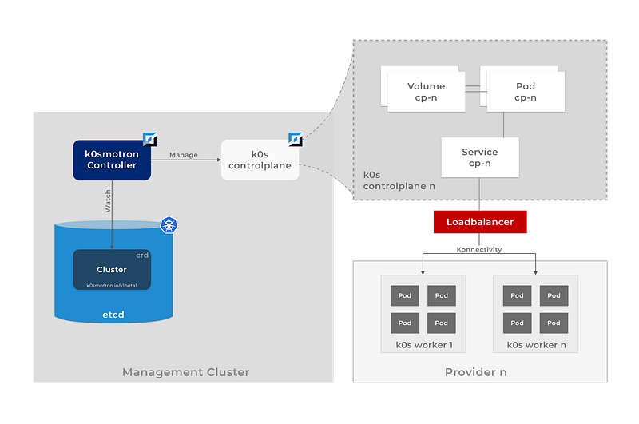

Container orchestration has revolutionised the way we develop, deploy, and manage applications. [Kubernetes](https://kubernetes.io/), with its rich set of features, has emerged as the de-facto standard for container orchestration. However, as the scale and complexity of applications grow, managing multiple Kubernetes clusters can be a daunting task.

Today, we are thrilled to announce our latest open source project — [k0smotron](https://k0smotron.io). k0smotron is essentially a set of Kubernetes controllers that allows you to run and manage multiple Kubernetes cluster control planes as pods within a single Kubernetes cluster. Yes, you heard it right — Kubernetes in Kubernetes!

With k0smotron, you can now consolidate your Kubernetes control planes, simplify your management and reduce your operational costs. You can also set up your Kubernetes clusters as ephemeral pods that can be spun up or down as per your workload requirements. k0smotron provides a seamless experience for Kubernetes developers and administrators who can now treat their Kubernetes cluster control planes as any other Kubernetes resource.

k0smotron is an open-source project and is available for you to try out today. It provides a robust and scalable architecture that is based on the same principles that have made Kubernetes so successful. With k0smotron, you get all the features of Kubernetes including scalability, high availability, and fault tolerance.

### How does it work

You install k0smotron operator into an existing Kubernetes cluster. k0smotron operator will create and manage k0s control planes in that cluster. It leverages the natural pattern of working with custom resources to manage the lifecycle of the k0s control planes. k0smotron will automatically create all the needed Kubernetes lower level constructs, such as pods, configmaps etc., to run the control plane within the Kubernetes management cluster.

k0smotron is an Kubernetes operator designed to manage the lifecycle of k0s control planes in a Kubernetes (any distro) cluster. By running the control plane on a k8s cluster we can enjoy and leverage the high availability and auto-healing functionalities of the underlying cluster, a.k.a management cluster. (We also call it the Mothership occasionally :D)

k0smotron exposes the control plane out from the management cluster e.g. via a LoadBalancer service. Just get the worker join token using k0smotron and you can connect worker nodes from ANY infrastructure. The management and worker planes do NOT have to run on the same infrastructure provider.

### Features

#### Kubernetes-in-Kubernetes

k0smotron allows you to easily create and manage the clusters in an existing Kubernetes cluster. This allows unparalleled scalability and flexibility when you have to work with many clusters. It allows a truly homogenous setup for all control planes and thus eases the maintenance burden.

#### Control and worker plane separation

Using k0smotron the clusters controlplane and workerplane are truly separated. The controlplane, running on an existing cluster has no direct networking connection to the workerplane. This is a similar pattern to how all the major cloud providers separate the control and worker planes on the managed clusters.

#### BYO Workers

k0smotron allows you to connect worker nodes from ANY infrastructure to your cluster control plane. One of the very cool things, technically, is the fact that the worker nodes can be on a very different infrastructure and networking segments as to the mothership cluster. This is achieved by utilizing, surprise-surprise, [k0s](https://k0sproject.io) as the underlying Kubernetes distro. k0s out of the box comes with all the needed configuration and components where the worker nodes open up a bi-directional tunnel (reverse SSH tunnels anyone?) which is used for the communications between various control plane and worker plane components.

### Use Cases

Here’s some example use cases we’ve had in mind where k0smotron can be very helpful.

#### Edge

Running Kubernetes on the network edge usually means running in low resource infrastructure. What this often means is that setting up the controlplane is either a challenge or a mission impossible. Running the controlplane on an existing cluster, on a separate dedicated infrastructure, removes that challenge and lets you focus on the real edge. Running on the edge often also means a large number of clusters to manage. Do you really want to dedicate nodes for each cluster controlplane and manage all the infrastructure for those?

#### CI/CD

Often when running integration and end-to-end testing for your software running in Kubernetes you need somewhat temporary clusters in CI. Why not leverage the true flexibility and create those clusters on-demand using k0smotron. Creating a controlplane is as easy as creating a custom resource, so is the deletion of it. No more long living snowflake clusters for CI purposes.

#### Dev Clusters

In Kubernetes the control plane is a bit of a resource hog as we know. Why not leverage an existing cluster to run the control plane for each developer and let them use their own worker nodes, even from local VMs. This way each developer can have their own development cluster without the need to run the control plane on their local machine.

### What about Cluster API?

While the initial release(s) of k0smotron are focusing on “standalone” control planes we do agree that there’s a smell of Cluster API on this. What we’re essentially doing is providing multiple cluster control planes using a controller, that’s what [CAPI](https://cluster-api.sigs.k8s.io/) is doing too, right?

The main difference between k0smotron and CAPI is the fact that CAPI does NOT provision the control planes utilizing the management cluster like k0smotron does. It usually provisions the control plane nodes (VMs typically) using some infrastructure provider like AWS, Google Cloud, Hetzner and so on. And on the same infrastructure where the worker plane is going to be provisioned.

Having said that, we are definitely looking at Cluster API direction of having k0smotron providing the controlplanes for the clusters. What this essentially means is that k0smotron can act as the provider for both ControlPlane and Bootstrap resources. What this would enable you to do is to use full Cluster API to manage the lifecycle of a full cluster, including the control plane running in the management cluster and also the worker infrastructure.

### Closing words

We are excited about the potential that k0smotron brings to the table, and we look forward to seeing how it can transform the way you manage your Kubernetes deployments. We’re really early on with the project and as always with any young project there are probably some sharp corners. But with the help of the open source community we plan to iron out those in the coming months. Stay tuned for more updates and resources as we continue to develop k0smotron and make it even better. And as always, we’re more than happy to hear your thoughts on k0smotron and the direction you’d want to see it go.

Check out our [GitHub repository](https://github.com/k0sproject/k0smotron) to learn more about k0smotron and start using it today!

