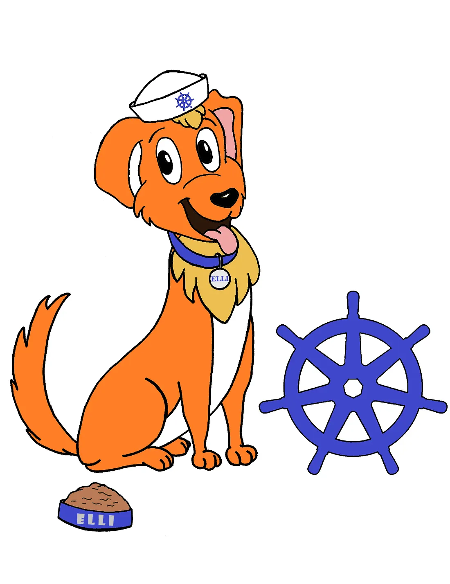

### Major updates, features, and enhancements for k0s, including nftables. Plus: k0s applies for CNCF Sandbox project status

The k0s project has seen significant updates over the past couple of months, introducing new features, improving existing functionalities, and ensuring the platform’s stability through several critical fixes and dependency upgrades. Here’s a breakdown of the most important changes and what they mean for you. To experience it, just [download the 1.31 release of k0s](https://github.com/k0sproject/k0s/releases).

The most notable new feature in this release is of course [Kubernetes 1.31, called Elli](https://kubernetes.io/blog/2024/08/13/kubernetes-v1-31-release/). Per kubernetes.io, “Elli is a cute and joyful dog, with a heart of gold and a nice sailor’s cap, as a playful wink to the huge and diverse family of Kubernetes contributors.”

### New Features and Enhancements

Team k0s thinks the following Kubernetes 1.31 new features deserve special mention:

**nftables backend** offers significant performance and scalability improvements over the iptables API. Enabled by default behind the NFTablesProxyMode feature gate, nftables mode excels at processing service endpoint changes and packets more efficiently, particularly in clusters with tens of thousands of services. It leverages advanced kernel processing capabilities, enhancing overall network efficiency and throughput.

**OCI images as volumes** is an alpha feature that allows OCI images to be used directly as volumes in Pods. This enhancement supports AI and ML use cases by enabling users to specify OCI image references as volumes and mount them within containers. To use this feature, enable the ImageVolume feature gate.

**cgroup v1 in maintenance mode**: In Kubernetes v1.31, support for cgroup v1 is moving to maintenance mode, reflecting the industry’s shift towards cgroup v2. While critical security fixes will continue, no new features will be added, and bug fixes will be on a best-effort basis. Users are encouraged to transition to cgroup v2 for enhanced functionality and scalability.

### k0s as a CNCF sandbox project?

About a year ago, we posted a note in the k0s open source repository asking our community whether k0s should apply to become a CNCF project at ‘sandbox’ level. The result was a resounding yes, and now we’ve submitted the application. If you’d like to see k0s as a CNCF project, and want to contribute to the process, please feel free to push your endorsement on the tracking issue: [https://github.com/cncf/sandbox/issues/125](https://github.com/cncf/sandbox/issues/125)

### k0s Changes

**Dependency Updates.** As we all know, we cannot run and build k0s or Kubernetes without dependencies. Keeping dependencies up to date helps mitigate bugs and ensures the project stays secure.

For k0s 1.31, the major components are at the following versions:

*   Kubernetes: 1.31.1
*   Containerd: 1.7.22
*   Runc: 1.1.14
*   Etcd: 3.5.16
*   Kine: 0.13.0
*   Metrics server: 0.7.2
*   Calico: 3.28.1
*   Kube-router: 2.2.1

For all the major components, k0s is now pretty much on the latest versions.

One special note on Kine: version 0.13.0 of Kine offers greatly improved performance when using PostgreSQL as the backend. According to the [enhancement](https://github.com/k3s-io/kine/pull/323) authors, they’ve seen almost 35x improvements when the DB holds 1M objects. I mean … wow, that’s just incredible.

**Dependabot.** One of the tools we utilize to help us stay up to date is [Dependabot](https://github.com/dependabot). Since the last minor release, 1.30, Dependabot has made more than 80 dependency updates. These updates ensure that k0s remains up-to-date with the broader ecosystem, providing users with the latest features and security enhancements.

**Dual-stack (IPv4 &amp; IPv6) with Kube-Router.** k0s now supports running dual-stack clusters with **kube-router**. In 1.31, we updated kube-router to the new 2.x series, which includes long-awaited support for dual-stack clusters. Starting to enable IPv6 in the cluster helps you prepare for the inevitable future of IPv6 and provides flexibility for integrating with various network environments.

As part of this effort, we’ve also done a big overhaul for [dual-stack documentation](https://docs.k0sproject.io/stable/dual-stack/?h=dual+stack).

**Ability to configure bind address.** k0s 1.31 comes with new config options to configure which addresses the **Kubernetes API server** binds to. This allows people running on hosts with multiple NICs/addresses to configure on which interface the API is visible.

**Cleanup obsolete images imported via airgap bundles.** One of the challenges of using k0s airgap image bundles has always been cleanup. To prevent kubelet from removing critical system images during its cleanup routines, k0s pins these images on containerd. With this enhancement, k0s now tracks the images it imports and can un-pin the ones no longer in use, making them free for cleanup.

Apart from these user-facing bigger changes, we’ve done a ton of smaller quality-of-life improvements, bug fixes, and chore work to keep the k0s code base stable and maintainable. Altogether, the 1.31 release cycle includes 500 or so commits. Read the [k0s 1.31 release notes](https://github.com/k0sproject/k0s/releases/tag/v1.31.1%2Bk0s.0) for the full scoop.

### Shout Outs

We want to give a special shout-out to our friends at [Replicated](https://www.replicated.com/). The Replicated team helped with several fixes and some new features during this release. We also have plans to deepen our relationship over the k0s project, so stay tuned.

We also want to highlight the folks submitting their first contribution to k0s:

*   [https://github.com/k0sproject/k0s/issues?q=is%3Apr+author%3Aplaes](https://github.com/k0sproject/k0s/issues?q=is%3Apr+author%3Aplaes)
*   [https://github.com/k0sproject/k0s/issues?q=is%3Apr+author%3Aianb-mp](https://github.com/k0sproject/k0s/issues?q=is%3Apr+author%3Aianb-mp)
*   [https://github.com/k0sproject/k0s/issues?q=is%3Apr+author%3Anekwar](https://github.com/k0sproject/k0s/issues?q=is%3Apr+author%3Anekwar)
*   [https://github.com/k0sproject/k0s/issues?q=is%3Apr+author%3Abizhao](https://github.com/k0sproject/k0s/issues?q=is%3Apr+author%3Abizhao)

Without the community, k0s would not be where it is today. Huge shout-out to the entire community: thank you all!

### Community Hours

We’re running monthly **community hours** calls for the project on the last Tuesday of the month.

Check the details at:[https://dateful.com/eventlink/2735919704](https://dateful.com/eventlink/2735919704)

We’ve also got plans to improve discussion channels for both k0s users and maintainers. Stay tuned!

### What’s Next?

As we move forward, the k0s project team remains committed to improving the platform’s stability, performance, and user experience. Stay tuned for more updates, and as always, we welcome feedback and contributions from the community.

If you happen to be at KubeCon+CloudNativeCon in Salt Lake City in November, come say hi at the Mirantis booth (R22). We’re always super happy to meet with community members and learn more about their use cases.

### Try k0s 1.31!

If you haven’t already, make sure to [upgrade to the latest version of k0s](https://github.com/k0sproject/k0s/releases) to take advantage of these new features and improvements. For more detailed information, you can always check out our [GitHub repository](https://github.com/k0sproject/k0s) and [docs](https://docs.k0sproject.io/stable/).

