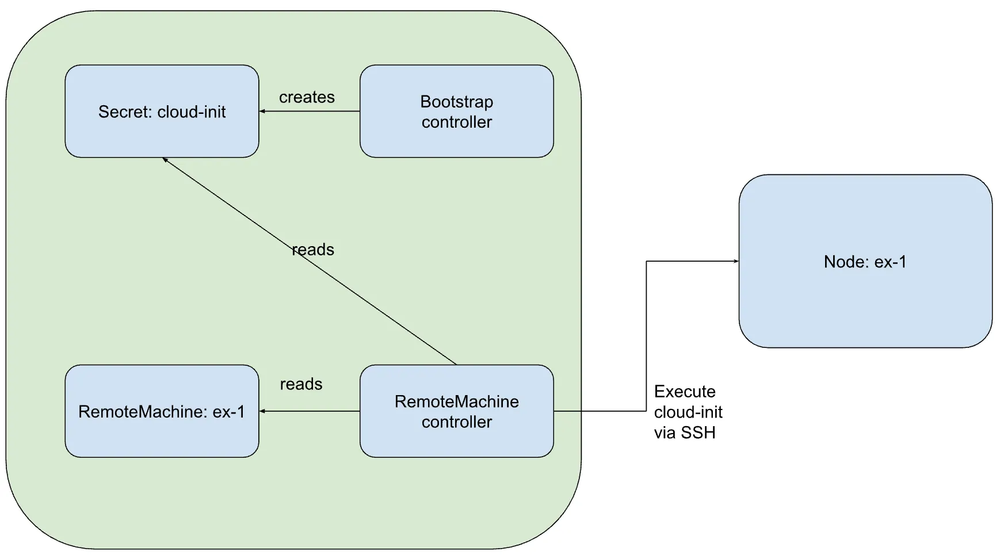
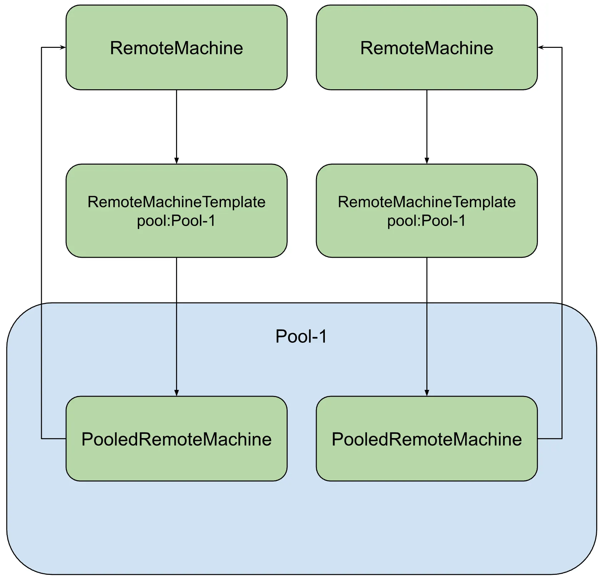

Managing multiple Kubernetes clusters, maybe even over multiple infrastructures, is definitely not easy. Cluster API can help you by bringing in a declarative way to manage both the infrastructure and the cluster setup. But what if you want to use on-premises, bare metal or other like such environments where existing Cluster API providers do not really have coverage? Not to worry, we’ve got your back. Now with [k0smotron](https://k0smotron.io) Anywhere, you can use Cluster API on ANY infrastructure, even bare metal, without the need to add any complexities to your infrastructure.

Today, we’re thrilled to announce availability of [k0smotron v0.8.0](https://github.com/k0sproject/k0smotron/releases/tag/v0.8.0) and the completion of k0smotron Anywhere (a.k.a [Remote Machine Infrastructure Provider](https://docs.k0smotron.io/stable/capi-remote/)). The completion means k0smotron Anywhere can now function as a [Cluster API](https://cluster-api.sigs.k8s.io/)-compliant infrastructure provider. This opens up new possibilities for managing remote machines seamlessly in your Kubernetes clusters.

In case you’ve forgotten what k0smotron is, it is essentially a set of Kubernetes controllers that allows you to run and manage multiple Kubernetes cluster control planes as pods within a single Kubernetes cluster. This allows for more granular control and much greater resiliency due to reducing the “blast radius” of any control plane failure. As Kubernetes gets deployed into more distributed applications, this more granular approach has become critical for reliability and resiliency. Since the [initial release](https://medium.com/k0sproject/introducing-k0smotron-c2ed6535ddc8?source=collection_home---6------4-----------------------) around 6 months ago it has evolved into much more than just control planes, it also acts as a general purpose [k0s](https://k0sproject.io) provider for ClusterAPI.

For those of you who’ve been using or following our k0s project, you know that we take our “Zero story” very seriously. In case of k0smotron Anywhere this means zero dependencies. The latest version is a testament how serious we are with that, practically allowing you to use ClusterAPI in provider-less mode. What do we mean by that? Read along and we’ll show you what it is and how it works.

### What is k0smotron Anywhere?

k0smotron Anywhere extends k0smotron’s capabilities as a ClusterAPI provider to seamlessly manage remote machines via SSH connections. This means you can now provision machines in any infrastructure, not limited to environments that support ClusterAPI and are API powered. You could think of it being the providerless provider for Cluster API.

### Key Benefits

*   **Flexibility:** Run your Kubernetes workloads on machines located anywhere, whether in the cloud, on-premises, or in hybrid setups.
*   **Infrastructure Neutrality**: k0smotron Anywhere supports ANY infrastructure, providing a consistent approach to managing your Kubernetes clusters via Cluster API.
*   **Use Existing Machines:** Leverage your existing machines by integrating them into your Kubernetes clusters with ease.

### How Does it Work?

With the k0smotron Anywhere feature, the possibilities are endless. Create RemoteMachines that define your remote infrastructure, specify their details like address, port, user, and SSH key. These remote machines can then be used as part of your Kubernetes cluster.

Essentially the `RemoteMachine` controller waits until it sees the cloud-init secret created by the bootstrap provider. Once the cloud-init is ready, it’ll connect to the `RemoteMachine` using SSH and executes the cloud init commands.

So say for example that you have a bare metal machine, running in your private data centre. Here’s an example how to define that as a `RemoteMachine`:



As you see, you only need to provide the SSH connectivity details like address, user and SSH key, via a secret, and you’re good to go. k0smotron `RemoteMachine` controller then uses these details, connects to the machine and executes the Bootstrap provider created cloud-init configuration. And with k0s “Zero Dependencies”, you basically only need to have the base Linux OS installed, nothing else. You’re free to use what ever Linux distro is your favourite and there’s absolutely no need to add any provisioning or other complexities to your infrastructure.

You can then use the `RemoteMachine` as part of the cluster, just like with any other infrastructure provider. For example you could use it as a worker node via a `Machine` object:



### Using RemoteMachine with MachineDeployments and ControlPlanes

As obvious, a `RemoteMachine` is a single machine ready to run as a Kubernetes node, either as a worker node or a control plane node. However, in some cases we need to be able to use those with ClusterAPI higher level constructs such as `MachineDeployment` and `ControlPlanes`. These require the usage of `MachineTemplates`. So how do we bridge the gap between a single `RemoteMachine` and a `MachineTemplate`?

This is where the concept of `RemoteMachine` pooling comes into play. Essentially, you can create several [`PooledRemoteMachine`](https://docs.k0smotron.io/stable/capi-remote/#using-remotemachines-in-machinetemplates-of-higher-level-objects) objects to mark machines that are ready to be used.

Here’s an example how to utilise `PooledRemoteMachines` via `RemoteMachineTemplate` objects:



When k0smotron sees a corresponding `RemoteMachineTemplate`, it’ll pick one free machine from the pool and create the corresponding `RemoteMachine` object. Naturally, k0smotron `RemoteMachine` controller keeps track of which `PooledRemoteMachine` is in use and for which `RemoteMachine`.

Once you have some pooled machines, you can use them with other ClusterAPI constructs via `RemoteMachineTemplate` objects:



Wait what? Does this mean I could utilize even things like autoscaling with my bare metal infrastructure? Well, sort of. Of course autoscaler cannot bring you new machines to the data center, but all this would allow you to use autoscaler, and other such things, in a way where you get a signal that we’d need another machine in the cluster. Then by adding a new machine to the pool, autoscaler and Cluster API would automatically pick that up and join it to the cluster.

### Benefits to the Ecosystem

The introduction of k0smotron Anywhere aligns with the broader goal of making Kubernetes clusters more adaptable and accommodating various infrastructure needs. With the support of RemoteMachines and pooling, k0smotron essentially opens up Kubernetes ClusterAPI to support ANY infrastructure, not only those already having a CAPI provider available. Not to mention cases like bare metal where the infrastructure is very hard to automate.

### What’s next?

Our upcoming focus includes the integration of [ClusterClass](https://cluster-api.sigs.k8s.io/reference/glossary.html#clusterclass) support across k0smotron. This significant enhancement aligns with our commitment to providing a comprehensive Kubernetes management solution. Additionally, we’re actively working on incorporating built-in support for [clusterctl](https://cluster-api.sigs.k8s.io/clusterctl/provider-contract.html#clusterctl-provider-contract). This advancement aims to streamline the initialization of k0smotron within the management cluster.

Once these features are seamlessly integrated, k0smotron will be nearing feature completeness. To us, feature completeness signifies a pivotal step towards General Availability (GA). This transition involves extensive efforts in refining documentation to ensure clarity and simplicity for users. Furthermore, our dedication extends to establishing top-notch maintenance and support processes, solidifying k0smotron as a robust and reliable solution.

Oh, and for those of you who manages the clusters using [Lens](https://k8slens.dev/), we’ve started to work on a Lens extension to bring full Cluster API visibility to Lens.

### Get Started Today!

Ready to harness the power of k0smotron Anywhere? Upgrade to the [latest version](https://github.com/k0sproject/k0smotron/releases/latest) and start exploring the flexibility and convenience of managing remote machines in your Kubernetes clusters.

Stay tuned for more updates and exciting features from the k0smotron team and ecosystem. Happy clustering! Oh, and do not forget to add a ⭐️ to our [GitHub repo](https://github.com/k0sproject/k0smotron/).

